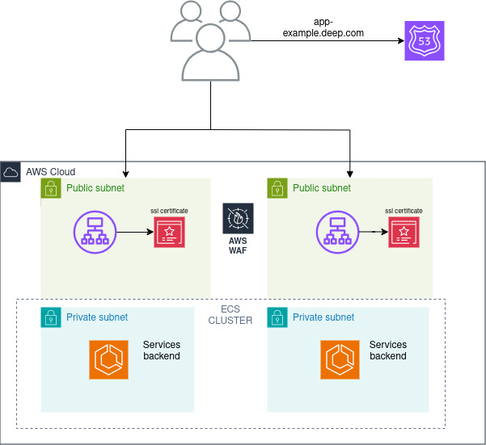
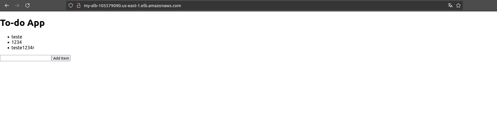

**Documentação da Infraestrutura Terraform - Desafio Deep**

Esta documentação descreve a infraestrutura projetada para uma aplicação simples utilizando o Amazon Elastic Container Service (ECS) para gerenciamento de contêineres.

**Arquitetura** 
Na imagem abaixo temos uma arquitetura de camadas bastante utilizada em aplicações web distribuidas no mercado. Com uma camada de balanceamento e uma camada de computação utilizando ECS, vou aprofundar um pouco mais abaixo sobre o por que utilização do ECS.



    Por que o ECS para camada computação?

    Gerenciamento de Contêineres: O ECS fornece uma plataforma altamente escalável para gerenciar contêineres Docker. Ele simplifica o gerenciamento de aplicativos em contêineres, sem a necessidade de gerenciar a infraestrutura subjacente.
    O ECS é uma boa alternativa de camada de computação para aplicações containerizadas para empresas que estão nesse momento convivendo com esse novo modo de trabalhar com aplicaões diariamente e que não tem uma camada de microserviços extensa.

    Por ser um serviço gerenciado e criado pela aws ele se integra nativamente com outros serviços AWS, como Elastic Load Balancer (ELB), CloudWatch, IAM e Auto Scaling, facilitando a configuração e o gerenciamento.

    Gerenciamento de Carga de Trabalho: Com o ECS, você pode definir e gerenciar tarefas e serviços, garantindo que os contêineres sejam executados conforme necessário e que a carga de trabalho seja distribuída de forma eficiente.

    Por que não EKS  para camada computação?
    O EKS Pode ser uma boa alternativa para camada de computação nesse teste, teria até mais familiariadade com meus conhecimentos. Mas, em um contexto onde temos apenas duas apps e com uma arquitetura não tão complexa em um cenário de uma empresa com poucos microserviços o eks(kubernetes) pode dar mais custo de gerenciamento nas operações. Por mesmo sendo um produto gerenciado as equipes ainda assim precisam se preocupar com operabilidade, evolução de versões, capacitação de pessoas e administração internas de fluxo de deployments com helm por exemplo. Para uma empresa que já utiliza o kubernetes on-premisse não vejo isso com um problema por já ser cenário comum no dia a dia, mas caso seja o inicio da jornada de containers na nuvem o ECS pode ser uma excelente opção.

**Estrutura da Infraestrutura**

Componentes Principais

    VPC (Virtual Private Cloud)
        CIDR Block: 10.0.0.0/16
        Sub-redes Públicas: 10.0.1.0/24 e 10.0.2.0/24
        Sub-redes Privadas: 10.0.3.0/24 e 10.0.4.0/24
        Internet Gateway: Permite que instâncias em sub-redes públicas acessem a internet.

    ECS Cluster
        Cluster Name: my-ecs-$ambiente
        Task Definition: Define como as tarefas do ECS são executadas, incluindo a configuração de logging.

    Auto Scaling Group
        Launch Configuration: Define a AMI (Amazon Machine Image), tipo de instância e perfil de IAM para as instâncias EC2.
        Auto Scaling Group: Gerencia a escala das instâncias EC2 no cluster ECS.

    Security Groups
        ECS Instance Security Group: Permite tráfego HTTP (porta 80/443) para instâncias EC2.

    Load Balancer
        Application Load Balancer: Distribui o tráfego para o serviço ECS.
        Target Group: Configurado para direcionar o tráfego para os services do  ECS.

    CloudWatch Logs
        Log Group: Configura logs para as tarefas ECS.

    IAM Roles and Policies
        IAM Roles: Permite que o ECS e as instâncias EC2 interajam com outros serviços AWS.
        IAM Policies: Concede permissões apropriadas para execução de tarefas e instâncias.

**Executando o Terraform**

Pré-requisitos

    Terraform instalado na sua máquina

    AWS CLI instalado na sua máquina

    Credenciais AWS: Configure suas credenciais AWS usando aws configure ou configure variáveis de ambiente AWS_ACCESS_KEY_ID e AWS_SECRET_ACCESS_KEY.

**Passos para Executar o Terraform**

    Baixar o Código Terraform
        Clone o repositório ou baixe o arquivo Terraform contendo a configuração da infraestrutura.

    Inicializar o Terraform na pasta terraform do repositório criado.

    bash


Antes de executar a infraestruta preencha as duas variáveis com as urls das imagens do ecr das aplicações utilizadas.

frontend-image-url
backend-image-url

```bash
terraform init
```
Este comando inicializa o diretório de trabalho contendo a configuração do Terraform, baixando os plugins necessários.

**Validar a Configuração**

bash
```bash
terraform validate
```
Valida a configuração do Terraform para verificar se há erros de sintaxe.

**Planejar a Aplicação**


```bash
terraform plan
```
Gera um plano de execução que mostra quais recursos serão criados, modificados ou destruídos.

**Aplicar a Configuração**

bash
```bash
terraform apply
```
Aplica as mudanças especificadas no plano, criando e configurando os recursos na AWS.

**Executando os testes**

Após realizar o deploy dos recursos na aws pegue o output que vai ser gerado na execução do terraform com o dns do mesmo(pode ser evoluido para um dns próprio com um cname de um servidor interno ou route53).

Realize o teste de conexão com esse dns e veja se a página abaixo da aplicação frontend é exibida.



**Destruir a Infraestrutura**

bash

    terraform destroy

    Remove todos os recursos criados pela configuração do Terraform.

**Pontos de Melhoria**

    Segurança
        IAM Policies: Revise e restrinja as permissões das políticas IAM e usar iam roles para tasks específicas

    Escalabilidade
        Auto Scaling: Ajuste as configurações do Auto Scaling Group para otimizar a escalabilidade e o desempenho das instâncias EC2 configurando o escalonamento de services baseado em métricas no cloudwatch.
    IAC
        Módulos: Nesse código está sendo usado uma abordagem sem modularização, mas como ponto de evolução o ideial é modularizar todos os recursos utilizados.

    Resiliência
        Backup: Configure backups regulares para o banco de dados(não criado nesse exemplo) e o S3 Bucket.

    Custo
        Instâncias EC2: Avaliar a implementação de instancias spot para redução de custos.
        NAT Gateway: Considere a utilização de NAT Instances em vez de NAT Gateway para reduzir custos se apropriado.

    Atualizações e Manutenção de Recursos
        AMI Atualizada: Ajusta o código para manter a ami utilizada sempre utilizada com a versão mais recente da mesma.

Se houver dúvidas adicionais favor entre em contato.